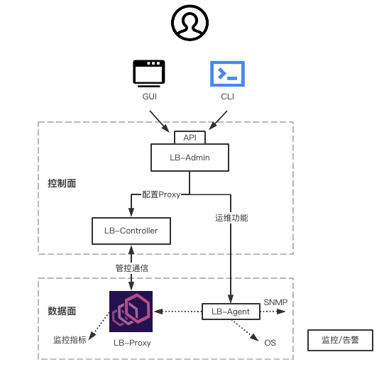
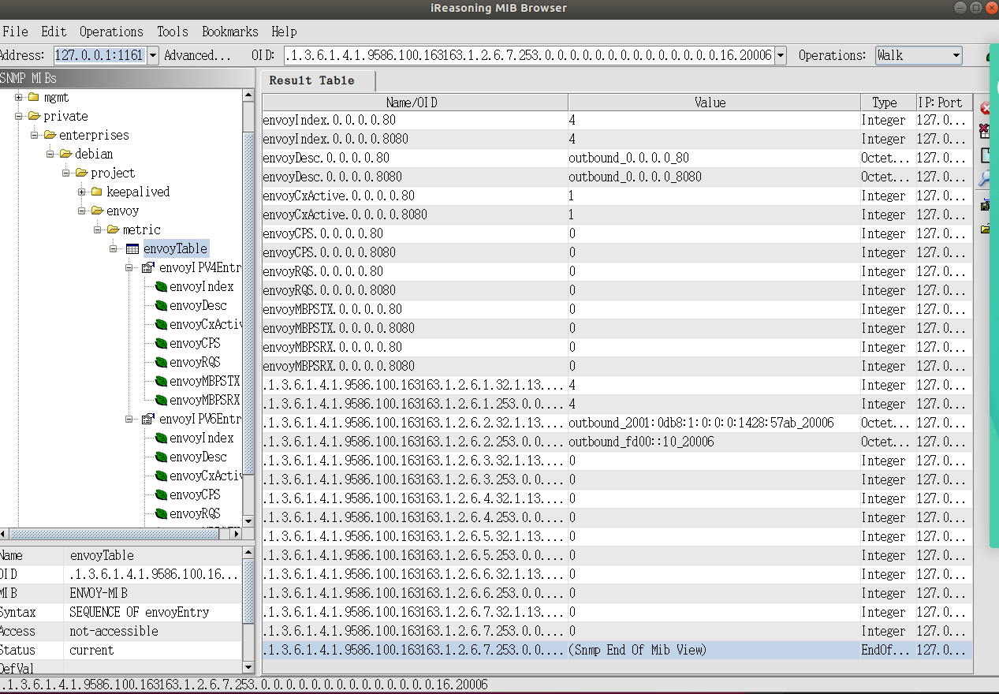

# 试用期工作总结

## 自我介绍

舒江，2017年6月东南大学硕士毕业，随后一直从事容器云相关开发工作。
2020年12月入职网易，所属部门是云计算技术中心-基础平台部-容器编排开发组，主管王新勇，导师黄久远。

## 学习培训

前半个月主要是熟悉工作环境，熟悉团队工作内容，完成新员工线上与线下的培训，包括财务、IT、法务、人力、行政等5门基础制度课程并参与考试。

## 工作情况介绍

### 自动诊断系统

Kube Diagnoser 是一个用于 Kubernetes 集群故障发现、诊断以及恢复的框架，集群的每个节点上运行着 Kube Diagnoser 的 Agent 组件来处理故障事件。Diagnosis 自定义资源是对故障事件的抽象。通过创建 Diagnosis 自定义资源，用户可以启动对已知的故障事件自动化诊断恢复的流水线。Kube Diagnoser 维护了故障诊断过程中的状态机，用户通过查看 Status 字段可以获取诊断结果。

1. Go Profiler 开发

   Go 性能剖析器用于在节点上获取某个进程的性能剖析数据，用户可以自定义在故障诊断恢复流程某个阶段中执行性能剖析器。

   当服务在其工作环境中运行时，持续剖析服务的性能可以帮助探究 CPU 周期和内存等资源用在了何处。Go Profiler 是一个低开销的统计性能剖析器，可从生产应用中持续收集有关 CPU 使用率和内存分配情况的信息。它会帮助用户识别应用中资源耗用量最大的部分，还可以阐明应用的性能特征。

   Go Profiler 从应用捕获性能剖析数据，并保存在本地。在收集了性能剖析数据之后，可以使用浏览器界面查看关于 CPU 和内存使用情况的统计信息与应用的各部分有何关联，以及通过火焰图分析应用。

   功能实现：

   * 支持 Profile，Heap 和 Goroutine 的剖析类型
   * 可配置 TLS，目前支持指定 Secret
   * Webhook 检测 Go Profiler参数
   * 性能分析文件本地保存，并且定时垃圾回收
   * 默认安装可连接 Apiserver 的 Serviceaccount，对集群 Apiserver 的剖析实现开箱即用
   * 一些项目文档编写,功能设计文档，概念文档，使用教程文档等

1. E2E 测试
   * 为自动诊断系统添加 Ginkgo 测试框架
   * 实现 E2E Framework，动态为每个测试创建一个独立的 Namespace，并在测试结束后销毁。
   * 添加 `circleci config`，为每一次提交创建新的 Kubernetes 环境运行 E2E 测试。

### 建行 LB 项目

   目标为设计实现企业级 L7 负载均衡器，具备网络功能，常用负载均衡算法（轮询、最小连接数、权重、优先权等），健康检查，会话保持，服务器控制，连接镜像，重定向，SSL加解密，业务监控等等功能。逻辑架构如图：

   

   负载均衡器主要区分为数据面与控制面两部分。
   LB-Proxy 是 L7 负载均衡的核心组件，其主要用于承载数据流量，对流量进行逻辑处理与分发。
   LB-Agent 是用于设备管理、运维管理的组件，可以对 LB-Proxy 的生命周期进行管理，如部署、异常拉起、升级等在线运维操作；可以对操作系统进行配置，如网络配置、ntp、syslog 等；此外还可以采集 LB-Proxy 指标数据，以SNMP上报到监控/告警系统。

   LB-Controller 是对数据面 LB-Proxy 连接并进行配置的控制面组件，包括建立并管理与 LB-Proxy 建立的连接、配置转换与分发，是控制 LB-Proxy 的基础组件。
   LB-Admin 是用于对外暴露控制API、负载均衡组件模型管理的控制面组件，包括负载均衡相关模型的管理、对外暴露 Restful API 等，是面向用户操作的入口组件。与之有关联的组件包括管理控制台 GUI 与命令行工具 CLI。

1. SNMP Exporter开发

    * 支持通过 SNMP 等设备性能和状态采集方式，需要监听 VS 级别的信息有：并发（活跃连接数）、新建连接数（CPS）、请求数（RPS）、吞吐等。
    * 读取 `envoy` 暴露的 `prometheus metrics`，进行解析，区分来自于哪个连接，通过当前值和缓存值进行计算
    * 能够动态增加/删除 `oid`
    * 支持 `snmpwalk` 查询统计项
    * 在 SNMP Export 中设计对象标识符 `oid（object identifier）`与监听资源之间的对应关系，并且编写实现对应的管理信息库（MIB）数据库

   结果展示：
  

1. LB CLI

   LB 命令行工具 CLI 基于 Restful API，提供便捷的负载均衡器设备管理、控制能力。
   * 目标组后端管理
   * 支持服务器上线、下线功能
   * 负载均衡集群管理
   * 负载均衡节点管理
   * 虚拟服务器管理
   * 安全策略管理
   * 服务器证书管理
   * 支持 HTTPS 协议
   * LB 集群配置备份、恢复

## 学习收获

* 学习 Kube Builder 的开发方式
* 了解学习了开源项目的规范性，文档的写作规范
* E2E 测试框架 Gingo、Gomega 的使用了解
* Circleci 工具的使用和脚本编写
* 了解了 SNMP 协议，与如何实现一个自己的 MIB 数据库
